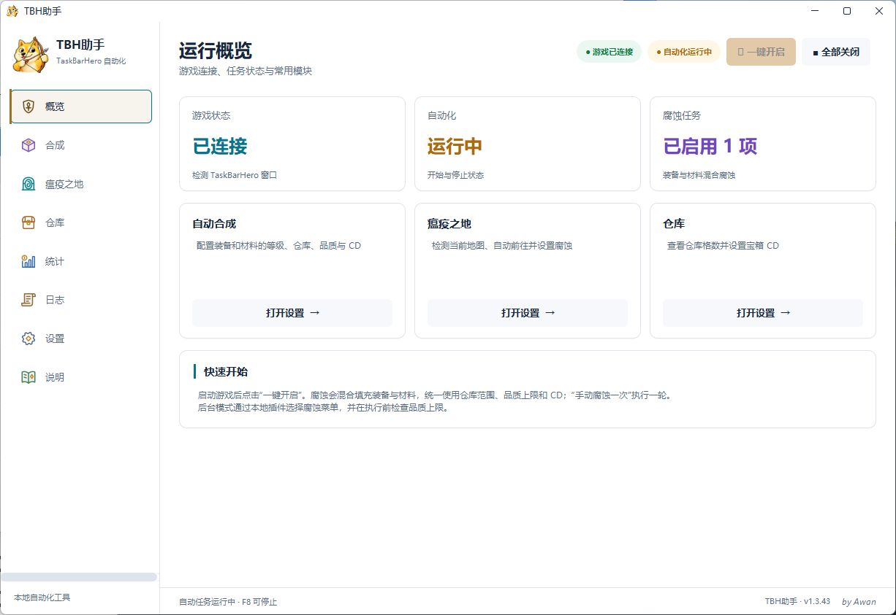
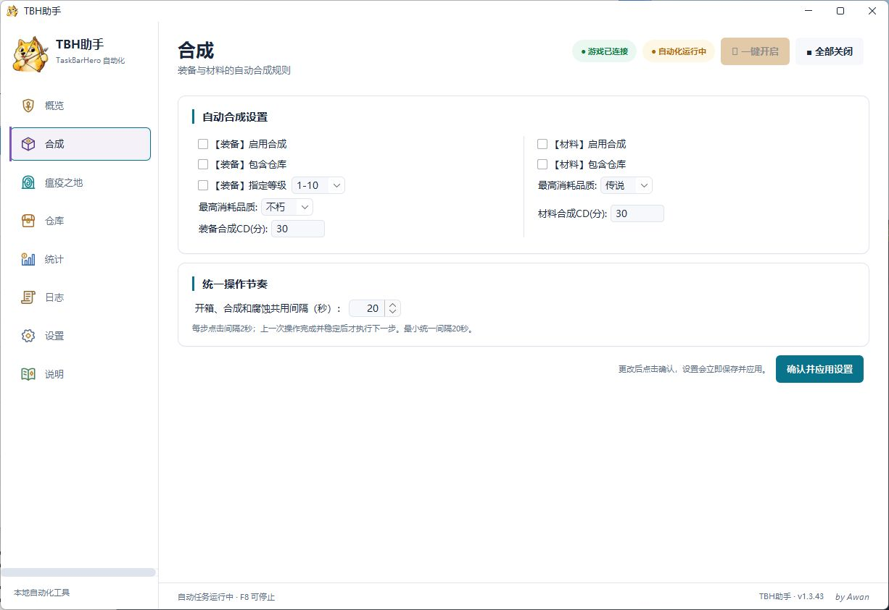
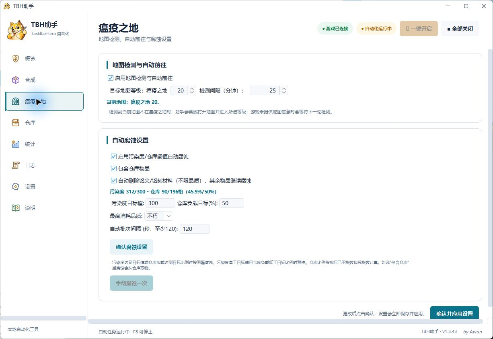
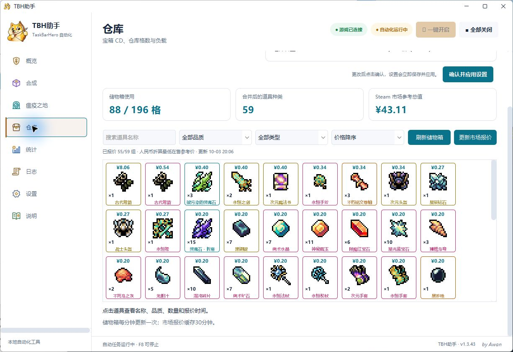
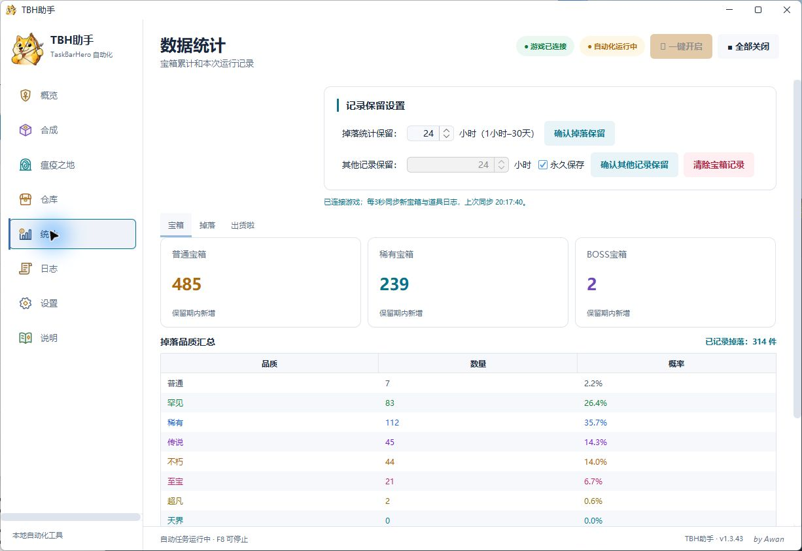
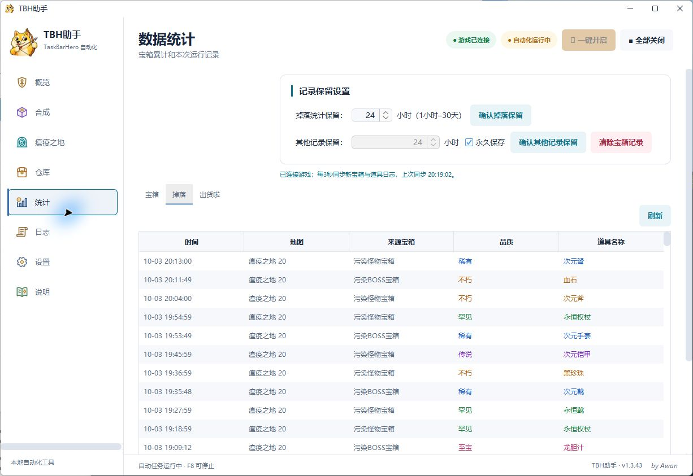

# 给 TaskBarHero 整理了一个后台助手：自动开箱、合成腐蚀，仓库带图片和参考价格

最近在玩 TaskBarHero，把自己反复用到的操作整理进了一个助手：开箱、存仓库、合成、去瘟疫之地，以及按品质规则腐蚀。现在也把代码和 Windows 下载包放到了 GitHub，方便大家试用和反馈。

**GitHub：** https://github.com/buguniaoOVO/TBHHelper

**下载页：** https://github.com/buguniaoOVO/TBHHelper/releases/tag/v1.3.47

当前助手版本 **1.3.47**，游戏插件 **1.3.43**，署名 **by Awan**。

## 平时挂机会用到的操作

助手在后台通过游戏内部入口执行动作，桌面程序显示连接状态、接收设置。自动开箱和仓库整理跟着总任务运行，装备合成、材料合成、腐蚀和自动前往地图各有自己的开关。

装备和材料可以分别设置最高品质、包含仓库、等级和 CD。地图页可以选择瘟疫之地强度 1～20，并按设置的间隔检查当前地图。

## 腐蚀时保护铭文材料

腐蚀页可以开启铭文、铭刻材料的自动剔除。检测到这类材料后逐件退回，剩下符合品质规则的物品继续腐蚀，允许不足 9 件；剔除后没有物品才跳过。

目前的运行日志里，剔除后剩 7 件和 4 件的批次都收到了成功回包。执行前还会检查游戏按钮状态，结束后等结果和动画完成，再开始下一步。

操作频率也做了限制：界面动作至少间隔 2 秒，开箱、合成、腐蚀和仓库整理共用默认 20 秒的间隔，腐蚀批次至少间隔 120 秒。统一间隔可以自己调；遇到服务器拒绝或结果不明时，助手会暂停后续提交。

## 仓库直接看道具图片

仓库页读取游戏储物箱，重复道具合并显示数量，可以搜名字、筛品质和类型，也可以按价格排序。上方会显示已报价道具的参考总值。

市场数据使用 TBHIndex 的 Steam 参考报价，再换算成人民币。价格有更新时间，缓存约 30 分钟。这里的数值用于查看库存，不代表实际出售所得，也不会替你挂单。

## 宝箱、掉落和品质分布

宝箱统计保留普通、稀有、BOSS 三类。掉落表按游戏原生日志周期读取新记录，也有手动刷新按钮。品质汇总显示数量和样本比例，并排除灵魂石、首领门票；“出货啦”会把重复物品折叠合并。

日志和掉落保留时间可设为 1 小时到 30 天，其他记录支持 1 小时起或永久保存。图里的物品和数字来自我自己的实际运行，每个人的存档和市场价格会不同。

## 怎么装

支持 Windows 10/11 64 位、Steam 版 TaskBarHero。

1. 从下载页获取 ZIP，完整解压。
2. 双击文件夹里的 **TBH助手.exe** 直接打开助手，不需要命令行，也不需要另装 Java。
3. 先退出游戏，在“设置/setting”页点“一键部署”，助手会写入后台环境与插件。
4. 从 Steam 启动游戏，等助手显示“游戏已连接”。
5. 检查品质、仓库范围、排除项和地图设置，再点“一键开启”。F8 可以停止。

下载包自带运行库。首次部署会先备份游戏目录里被覆盖的文件；首次启动游戏会生成接口文件，需要等它完成初始化。新包的合成、腐蚀和自动前往地图默认关闭，先看好设置再启用。

## 目前的说明

这是第三方维护工具，适配会受游戏更新影响。目前版本经过编译、填充和退回检查，也参考了本机运行日志，跨电脑首次安装仍需要更多反馈。历史日志缺字段时，地图或数量可能不完整；旧版灵魂石历史记录也还没有重建。

如果遇到问题，欢迎在 GitHub Issues 留下游戏、助手、插件版本，发生时间和具体操作。截图和相关日志也能帮助定位，发之前请检查有没有个人信息。

程序免费分享，源码与来源说明在 GitHub。如果用着顺手，可以点个 Star，或者通过发电图支持后续维护。

**by Awan**
